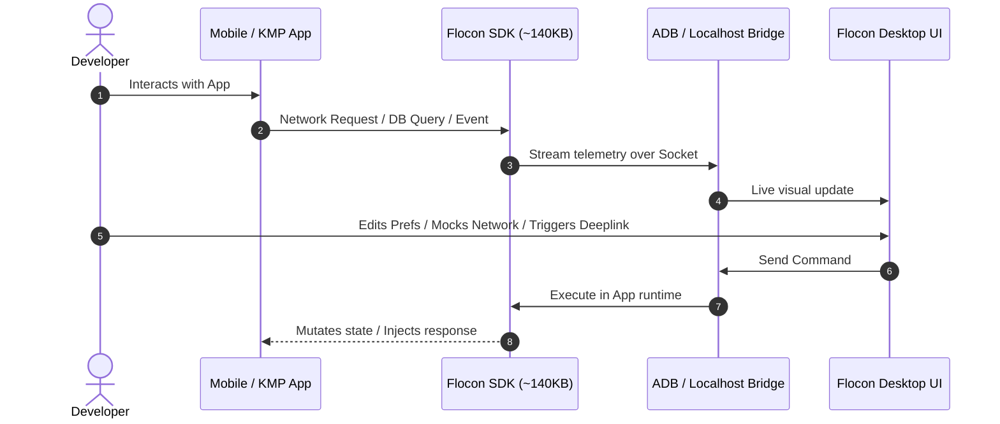

# Flocon

An advanced, lightweight debugging & inspection tool built with <strong>Kotlin Multiplatform (KMP)</strong> and <strong>Compose Multiplatform</strong>, designed to seamlessly inspect and debug Android, JVM, and iOS applications in real time.

[Get Started :octicons-arrow-right-24:](setup.md){ .md-button .md-button--primary }
[Download Desktop App :octicons-download-24:](https://github.com/openflocon/Flocon/releases){ .md-button }
[View on GitHub :octicons-mark-github-16:](https://github.com/openflocon/Flocon){ .md-button }

---

---

## ⚡ Highlights & Key Features

-   :material-swap-horizontal: __Network & API Inspector__

    ---

    Capture and inspect all HTTP/REST (OkHttp, Ktor), GraphQL (Apollo), WebSockets, and gRPC requests with payload formatting and status codes.
    
    [:octicons-arrow-right-16: Learn more](network.md)

-   :material-theater: __Live Request Mocking__

    ---

    Intercept network calls on the fly and provide custom responses or simulate error status codes without writing boilerplate test mocks.

    [:octicons-arrow-right-16: Learn more](network.md#http-request-mocking)

-   :material-database: __Database Explorer & SQL Editor__

    ---

    Explore schemas, browse tables, run custom SQL queries with syntax highlighting, and log live database queries for Room & SQLite.

    [:octicons-arrow-right-16: Learn more](database.md)

-   :material-view-dashboard: __Reactive Custom Dashboards__

    ---

    Build custom mobile debug dashboards with buttons, forms, inputs, and Kotlin `Flow` bindings that render interactively on your desktop.

    [:octicons-arrow-right-16: Learn more](dashboard.md)

-   :material-key: __Preferences & DataStore__

    ---

    Inspect and edit `SharedPreferences`, `Jetpack DataStore`, and custom key-value stores in real-time from the desktop companion.

    [:octicons-arrow-right-16: Learn more](sharedpref.md)

-   :material-link-variant: __Deeplink Runner & Tools__

    ---

    Auto-discover and trigger parameterized deeplinks with autocomplete, inspect app sandboxed files, and preview downloaded images.

    [:octicons-arrow-right-16: Learn more](deeplink.md)

---

## 🏗️ Architecture Overview

Flocon connects your running mobile/desktop app to the Flocon Desktop companion over a lightweight local socket connection (via ADB on Android or direct sockets on Desktop/iOS):

---

## 📱 Platform Support Matrix

| Feature | Android | Desktop (JVM) | iOS (Simulator) | iOS (Device) |
| :--- | :---: | :---: | :---: | :---: |
| **Network (HTTP / Ktor / OkHttp)** | :white_check_mark: | :white_check_mark: | :white_check_mark: | Coming soon |
| **Network Mocking** | :white_check_mark: | :white_check_mark: | :white_check_mark: | Coming soon |
| **GraphQL & gRPC** | :white_check_mark: | :white_check_mark: | Coming soon | Coming soon |
| **WebSockets** | :white_check_mark: | :white_check_mark: | Coming soon | Coming soon |
| **Database (Room / SQLite)** | :white_check_mark: | :white_check_mark: | :white_check_mark: | Coming soon |
| **Preferences & DataStore** | :white_check_mark: | Coming soon | Coming soon | Coming soon |
| **Reactive Dashboards** | :white_check_mark: | Coming soon | Coming soon | Coming soon |
| **Data Tables** | :white_check_mark: | :white_check_mark: | :white_check_mark: | Coming soon |
| **Analytics Viewer** | :white_check_mark: | :white_check_mark: | :white_check_mark: | Coming soon |
| **Deeplink Launcher** | :white_check_mark: | Coming soon | Coming soon | Coming soon |
| **Sandbox File Explorer** | :white_check_mark: | Coming soon | Coming soon | Coming soon |
| **Image Previewer** | :white_check_mark: | :white_check_mark: | :white_check_mark: | Coming soon |

---

Ready to inspect your app in real-time?

[Start Setup Guide :octicons-arrow-right-24:](setup.md){ .md-button .md-button--primary .md-button--large }

