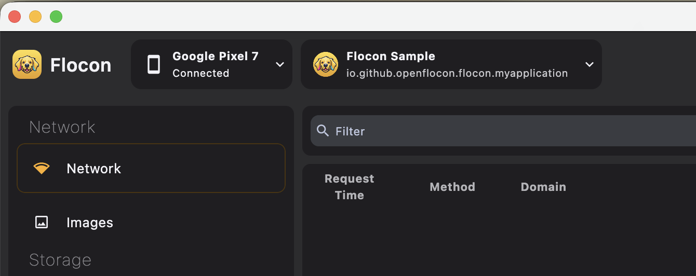
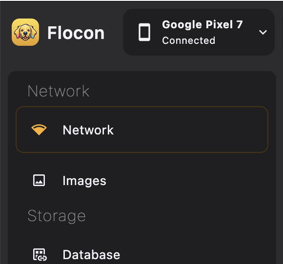
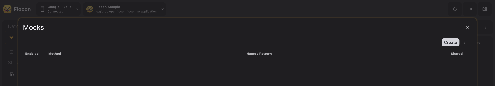
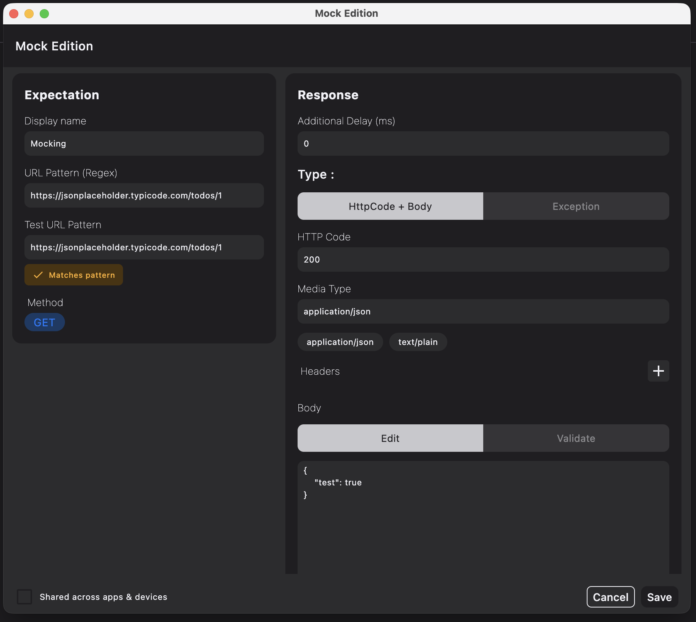
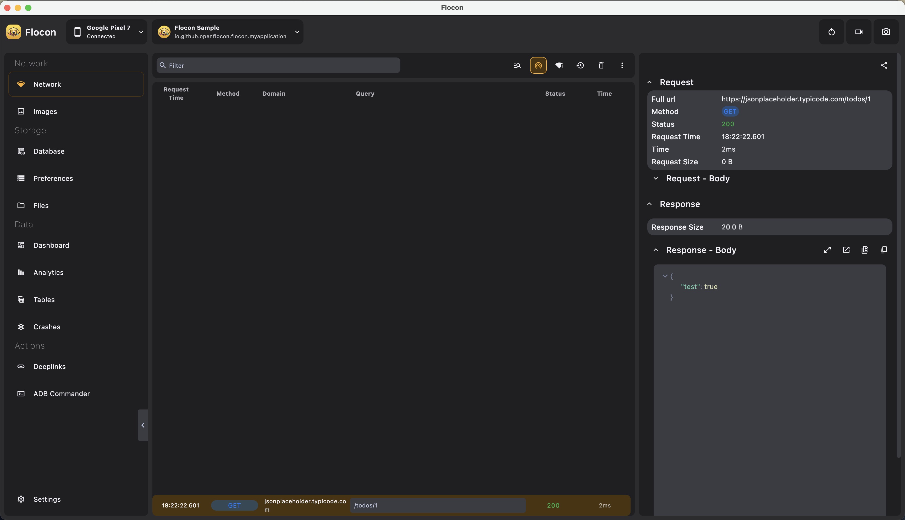

# 🎭 Step-by-Step Tutorial: Network Mocking with Flocon

With Flocon, you can **intercept live HTTP requests and replace them with custom mock responses** directly from your desktop interface. 

You can test error handling (401 Unauthorized, 404 Not Found, 500 Internal Server Error), inject mock JSON data for unreleased backend features, or simulate slow network latency without writing test boilerplate or modifying your codebase.

---

## Prerequisites

Before starting, ensure you have:
1. Integrated the **Flocon SDK** into your Android or Kotlin Multiplatform project.
2. Downloaded and launched the **[Flocon Desktop App](https://github.com/openflocon/Flocon/releases)**.
3. Connected your test device or emulator (via USB debugging / ADB).

---

## Step 1: Install Network Interceptor

Add the appropriate network interceptor to your project depending on your networking library:

=== "With OkHttp (Android)"

    Add dependencies:
    ```kotlin
    dependencies {
        debugImplementation("io.github.openflocon:flocon-okhttp-interceptor:LAST_VERSION")
        releaseImplementation("io.github.openflocon:flocon-okhttp-interceptor-no-op:LAST_VERSION")
    }
    ```

    Attach `FloconOkhttpInterceptor` to your `OkHttpClient`:
    ```kotlin
    val okHttpClient = OkHttpClient.Builder()
        .addInterceptor(FloconOkhttpInterceptor())
        .build()
    ```

=== "With Ktor (Kotlin Multiplatform)"

    Add dependencies in `commonMain`:
    ```kotlin
    kotlin {
        sourceSets {
            commonMain.dependencies {
                implementation("io.github.openflocon:flocon-ktor-interceptor:LAST_VERSION")
            }
        }
    }
    ```

    Install `FloconKtorPlugin` in your `HttpClient`:
    ```kotlin
    val httpClient = HttpClient {
        install(FloconKtorPlugin)
    }
    ```

---

## Step 2: Connect App to Flocon Desktop

1. Launch your mobile application on an emulator or physical device.
2. Open **Flocon Desktop** on your computer.
3. Verify that your device and application package name appear in the top-left device selector.



---

## Step 3: Trigger a Baseline Network Call

1. In your mobile application, perform an action that triggers a network request (e.g., loading a profile screen, fetching items).
2. In Flocon Desktop, open the **Network** tab.
3. You will see the live request appear in the list with its method, URL, status code, and response time.



---

## Step 4: Open the Mocks Manager Dialog

You can access the **Mocks Manager Dialog** in one of two ways:

### Method A: From the Network Toolbar (Mocks Icon)
Click the **Mocks** icon (WiFi Tethering icon) in the top-right action toolbar of the Network tab. This opens the Mocks Manager dialog displaying all existing mock rules and an **Add Mock** button.

### Method B: Directly from a Captured Request (Recommended)
1. In the Network Inspector table, select the request you wish to mock.
2. In the right-hand details panel, click the **Create Mock** (or **Mock this Call**) button.
3. The Mocks Manager dialog will open immediately with the endpoint URL, HTTP method, request headers, and original JSON response body already pre-filled.



---

## Step 5: Configure Mock Rules & Response

Inside the Mock Editor modal:

1. **Set URL & Method Expectations**:
    - **URL Matching Pattern**: Enter the endpoint URL or URL pattern (supports wildcards/exact match, e.g. `https://api.example.com/users/*`).
    - **HTTP Method**: Choose `GET`, `POST`, `PUT`, `DELETE`, etc.
2. **Configure the Simulated Response**:
    - **HTTP Status Code**: Set the desired code (e.g., `200 OK`, `401 Unauthorized`, `404 Not Found`, `500 Internal Server Error`).
    - **Response Body**: Edit the JSON payload directly with syntax highlighting.
    - **Response Delay (ms)**: Set an artificial delay (e.g., `1500 ms`) to test loading skeletons, shimmer effects, and progress spinners.
    - **Headers**: Add custom response headers (e.g., `Content-Type: application/json`).
3. Click **Save & Enable Mock**.



---

## Step 6: Trigger the Call & Verify

1. Return to your mobile application.
2. Re-trigger the same action (e.g., pull to refresh or re-open the screen).
3. **In the mobile app**: The app receives the mock response immediately without contacting the backend server!
4. **In Flocon Desktop**: The request is logged in the Network Inspector with a visible **`[MOCKED]`** tag and purple badge.



---

## Step 7: Advanced Mock Management

Inside the **Mocks Manager Dialog**:

### 1. Live Enable / Disable Toggling
Each mock has an **Enabled / Disabled** toggle switch. Switch mocks on and off instantly without deleting your configuration rules.

### 2. Simulating Hard Network Failures
Instead of returning a JSON body with an HTTP 500 status code, select **Error / Exception** mode in the editor to simulate physical connection drops (`IOException`, timeouts) and test retry/offline UI states.

### 3. Export & Import Mock Profiles
Use the **Export** and **Import** buttons in the dialog to save your mocks to `.json` files. You can:
- Share mock suites with your team.
- Attach edge-case scenarios to bug reports for QA.
- Switch between different test profiles (e.g. Happy Path, Edge Cases, Outage Simulation).

---

## Summary Checklist

| Action | Where |
| :--- | :--- |
| **1. Install Interceptor** | Add `FloconOkhttpInterceptor` (OkHttp) or `FloconKtorPlugin` (Ktor) |
| **2. Connect App** | Ensure device appears in Flocon Desktop top bar |
| **3. Capture Request** | Trigger baseline request from mobile app |
| **4. Open Mock Manager** | Click the **Mocks** toolbar icon or **Create Mock** on a captured request |
| **5. Customize Rules** | Modify status code, response body, latency delay |
| **6. Verify** | Re-run in mobile app and look for the `[MOCKED]` indicator |
